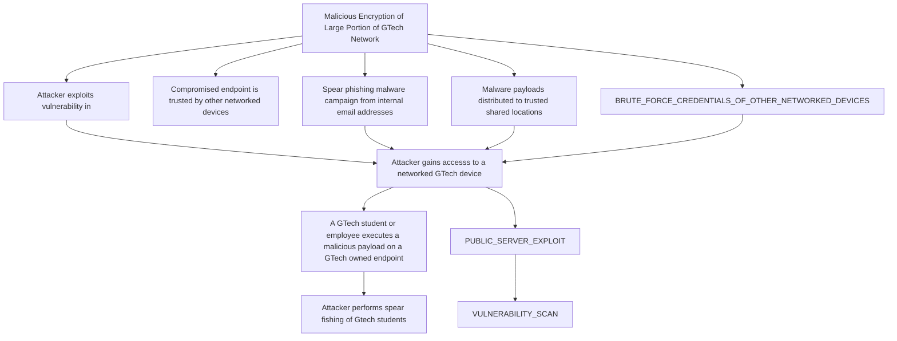

```mermaid
flowchart TD
    GOAL[Malicious Encryption of Large Portion of GTech Network]

    EXPLOIT_REMOTE_SERVICES[Attacker exploits vulnerability in]
    PERMISSIONS_LATERAL_MOVEMENT[Compromised endpoint is trusted by other networked devices]
    INTERNAL_PHISHING[Spear phishing malware campaign from internal email addresses]
    TAINT_SHARED_CONTENT[Malware payloads distributed to trusted shared locations]
    BRUTE_FORCE_CREDENTIALS_OF_OTHER_NETWORKED_DEVICES
    ACCESS_ENDPOINT[Attacker gains accesss to a networked GTech device]

    SPEAR_FISHING[Attacker performs spear fishing of Gtech students]

    RUNS_MALICIOUS_EXECUTABLE[A GTech student or employee executes a malicious payload on a GTech owned endpoint]

    PUBLIC_SERVER_EXPLOIT
    VULNERABILITY_SCAN


    GOAL --> EXPLOIT_REMOTE_SERVICES
    GOAL --> INTERNAL_PHISHING
    GOAL --> TAINT_SHARED_CONTENT
    GOAL --> BRUTE_FORCE_CREDENTIALS_OF_OTHER_NETWORKED_DEVICES
    GOAL --> PERMISSIONS_LATERAL_MOVEMENT

    EXPLOIT_REMOTE_SERVICES --> ACCESS_ENDPOINT
    INTERNAL_PHISHING  --> ACCESS_ENDPOINT
    TAINT_SHARED_CONTENT  --> ACCESS_ENDPOINT
    BRUTE_FORCE_CREDENTIALS_OF_OTHER_NETWORKED_DEVICES  --> ACCESS_ENDPOINT

    ACCESS_ENDPOINT --> RUNS_MALICIOUS_EXECUTABLE

    RUNS_MALICIOUS_EXECUTABLE --> SPEAR_FISHING

    ACCESS_ENDPOINT --> PUBLIC_SERVER_EXPLOIT
    PUBLIC_SERVER_EXPLOIT --> VULNERABILITY_SCAN
```
