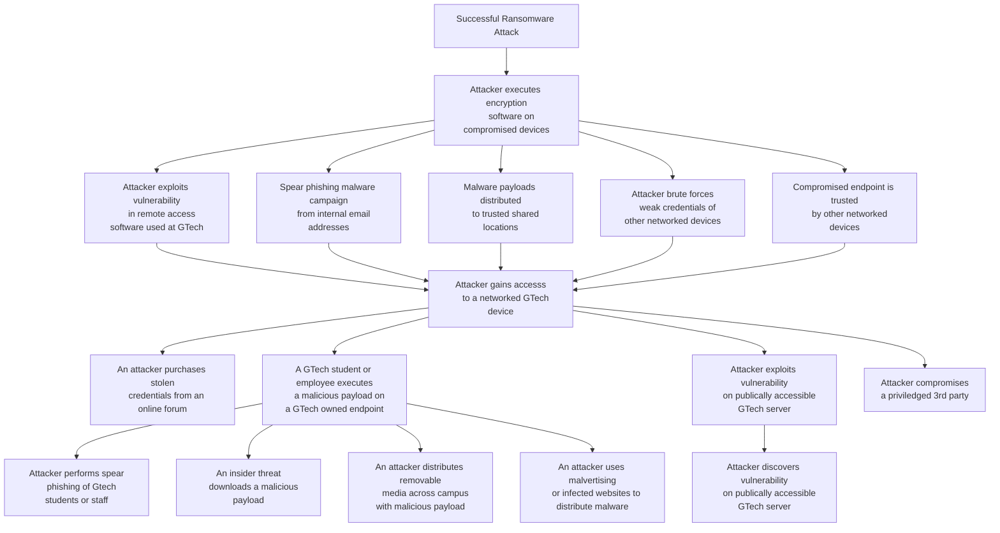

```mermaid
flowchart TD
    
    GOAL_FINAL[Successful Ransomware Attack]
    GOAL[Attacker executes encryption
     software on compromised devices]

    EXPLOIT_REMOTE_SERVICES[Attacker exploits vulnerability
     in remote access software used at GTech]
    PERMISSIONS_LATERAL_MOVEMENT[Compromised endpoint is trusted
     by other networked devices]
    INTERNAL_PHISHING[Spear phishing malware campaign
     from internal email addresses]
    TAINT_SHARED_CONTENT[Malware payloads distributed
     to trusted shared locations]
    BRUTE_FORCE_CREDENTIALS_OF_OTHER_NETWORKED_DEVICES[Attacker brute forces
     weak credentials of other networked devices]
    ACCESS_ENDPOINT[Attacker gains accesss
     to a networked GTech device]

    SPEAR_FISHING[Attacker performs spear
     phishing of Gtech students or staff]
    INSIDER_THREAT[An insider threat
     downloads a malicious payload]
    REMOVABLE_MEDIA[An attacker distributes removable
     media across campus with malicious payload]
    DRIVE_BY[An attacker uses malvertising
    or infected websites to distribute malware]

    CREDENTIAL_PURCHASE[An attacker purchases stolen
    credentials from an online forum]

    RUNS_MALICIOUS_EXECUTABLE[A GTech student or employee executes
     a malicious payload on a GTech owned endpoint]

    PUBLIC_SERVER_EXPLOIT[Attacker exploits vulnerability
     on publically accessible GTech server]
    VULNERABILITY_SCAN[Attacker discovers vulnerability
     on publically accessible GTech server]

    THIRD_PARTY[Attacker compromises
    a priviledged 3rd party]

    GOAL_FINAL --> GOAL
    GOAL --> EXPLOIT_REMOTE_SERVICES
    GOAL --> INTERNAL_PHISHING
    GOAL --> TAINT_SHARED_CONTENT
    GOAL --> BRUTE_FORCE_CREDENTIALS_OF_OTHER_NETWORKED_DEVICES
    GOAL --> PERMISSIONS_LATERAL_MOVEMENT

    EXPLOIT_REMOTE_SERVICES --> ACCESS_ENDPOINT
    INTERNAL_PHISHING  --> ACCESS_ENDPOINT
    TAINT_SHARED_CONTENT  --> ACCESS_ENDPOINT
    BRUTE_FORCE_CREDENTIALS_OF_OTHER_NETWORKED_DEVICES  --> ACCESS_ENDPOINT
    PERMISSIONS_LATERAL_MOVEMENT --> ACCESS_ENDPOINT

    ACCESS_ENDPOINT --> RUNS_MALICIOUS_EXECUTABLE

    RUNS_MALICIOUS_EXECUTABLE --> SPEAR_FISHING
    RUNS_MALICIOUS_EXECUTABLE --> INSIDER_THREAT
    RUNS_MALICIOUS_EXECUTABLE --> REMOVABLE_MEDIA
    RUNS_MALICIOUS_EXECUTABLE --> DRIVE_BY

    ACCESS_ENDPOINT --> THIRD_PARTY
    ACCESS_ENDPOINT --> CREDENTIAL_PURCHASE

    ACCESS_ENDPOINT --> PUBLIC_SERVER_EXPLOIT
    PUBLIC_SERVER_EXPLOIT --> VULNERABILITY_SCAN

```
